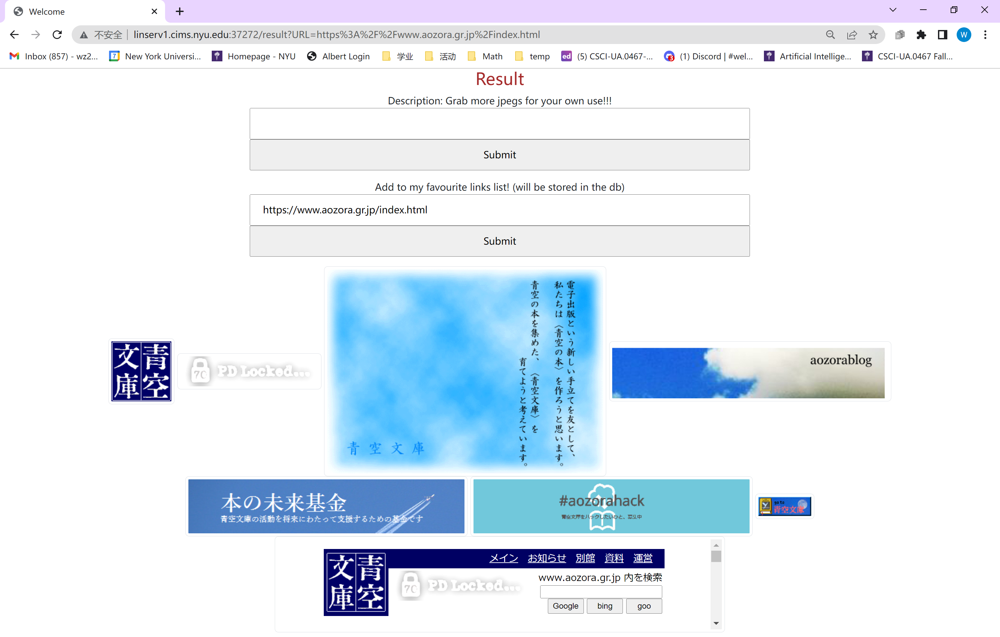
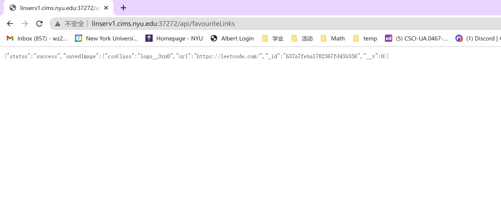

# Reptile Teapot Express 

## Overview

The purpose of this project is to take a website (e.g. NBA) and grab all the pictures (jpeg, jpg, PNG, etc.) from the site and group them under its css class. 

Then it provides options such as combining images selected by the user into a PDF for the user to download. Of course, it will attach all the sources and liscence of usage. 

## Data Model

The application will store the list of CSS classes and images. 

* Each CSS classes can have multiple images
* each image has some basic information

An Example image:

```javascript
{
  cssClass: "someClass",
  url: "someURL"
}
```

The css classes schema is built as a reference based referencing our image schema:

```javascript
const cssClassSchema = new mongoose.Schema({
  lists:  [{ type: mongoose.Schema.Types.ObjectId, ref: 'img' }]
});
```


## [Link to Commented Second Draft Schema](db.mjs) 

## Wireframes

/ - welcome page for entering an url


/result - page for showing all images with an extra iframe for the url the user entered for a double check purpose. 



The second form on the website will lead to a AJAX interation that add this current links to the favourite links dbs (so you can download images in bundle across different websites at a single click, amazing isn't it!). And the status of adding this link into the db will be displayed: 



/api/favouriteLinks - page for showing all links you've added as your favourite links. 


## Site map


## User Stories or Use Cases

1. as a user, I can enter any legal url I want to the form in the welcome page
2. as a user, you can then retrieve a list of images categorized by its css class. 
3. you can also select output format, such as pdf to be export, but an extra liscence, acknowledgement, or credit page will be automatically added.

## Research Topics

* (2 points) Bootstrap
    * I'll use the bootstrap to decorate my website, especcially the images. 
* (5 points) automate the test using Selenium 
* (5 points) puppeteer
    * use puppeteer to synchronously load the page using an URL and manipulate that page just like we can do with same origin's pages with DOM. 

12 points total out of 10 required points. 

## How Selenium works in my project
  <b>Please note that the following codes must be done in a separate terminal. And it assumes that the user is working under the project directory</b>
  ```sh
  cd test
  node testApp.mjs
  ```
  Sample work through: 
  
  Note that these are all done autimatically with no mouse or keyboard interference. 
  If successed, the result should be like: 
  ```sh
  Test 1 passed: The page is served
  Test 2 passed: The website could be lauched successfully
  Test 3 passed: The result page is shown correctly
  Test 4 passed: The db status page is shown successfully
  The test finished
  ```


## [Link to Initial Main Project File](app.mjs) 
## Annotations / References Used

1. https://www.bilibili.com/video/BV12E411A7ZQ/?spm_id_from=333.1007.top_right_bar_window_custom_collection.content.click
2. https://www.youtube.com/watch?v=S67gyqnYHmI&t=663s
3. https://www.youtube.com/watch?v=d5jA-_KeVas

